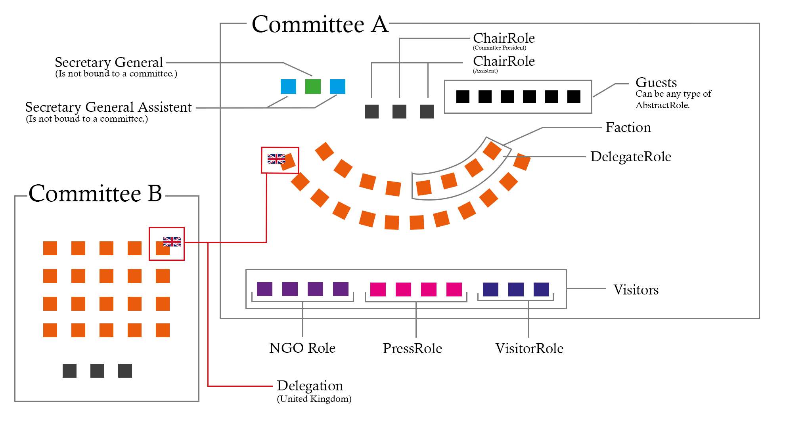

# Conference Roles

MUNity handles every user inside the conference in some form of role. Roles are also importend for the application phase and general committee structure, because every committee contains a list of delegate roles that resamble different countries inside the committee.

To get a general idea of the different roles you can take a look at the graphic below.



## TeamRole

Is the type of role you can use for anyone that is organizing the conference in any way. You can differ between the team Roles by giving them different names. Also TeamRoles can be inside TeamRoleGroups. That means you can create a group of "Head of Oganzisation" with the TeamRoles: "Team-Leader", "Event Organisator", "Financal Manager" etc.

## DelegateRole

A DelegateRole represents one country in one given committee. This role is part of a Delegations. Not all DelegateRoles inside a Delegation have to resemble the same Country. You can also create a Delegation for all countries of the European Union.

## ChairRole

The ChairRole is the leading role of a committee. There is a ```ChairRoleType``` Parameter that allows to differ between the "Committee President" and on or more "Assistant"s. There is no limit on how many ChairRoles are inside a committee. You can also set all the ChairRoles to President or Assistent.

## NGORole

Is the role for any non-governmental organization.

## Press Role

For a conference press. You can differ between __TV__, __Print__ and __Online__ Press Types. You can also set different type of PressRole types by setting the Name to something like: "Editor", "Reporter" etc.

## Visitor Role

Is for anyone who just attends the conference without a certain task. For example teachers, parents or other types of spectators. This role is mostly needed if you need to keep track of any of these people, for example with a digital registration system.